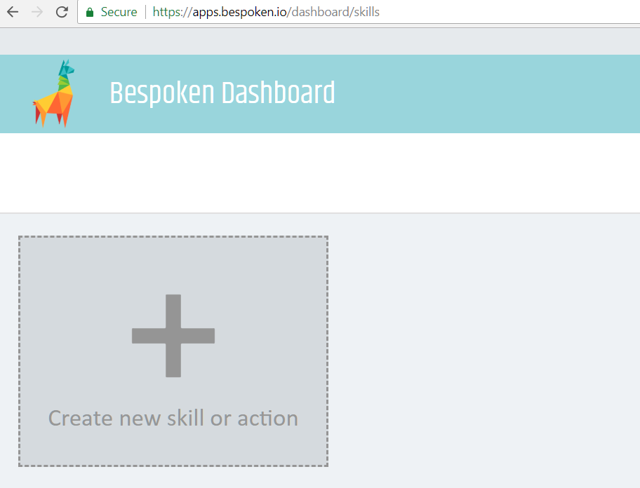
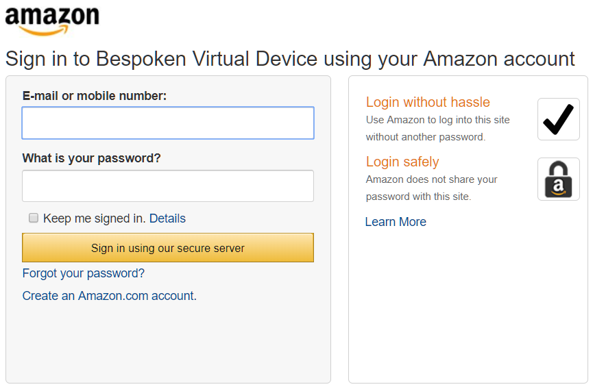
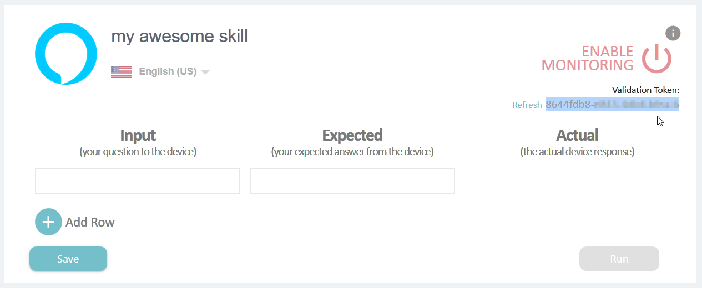
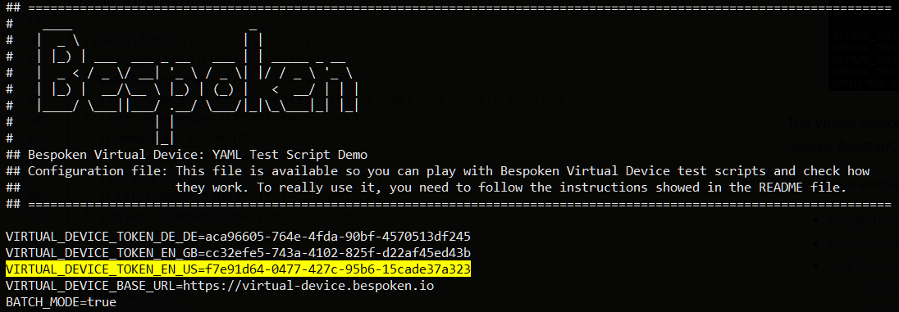

# Setting up Virtual Device
## Background
We need a Virtual Device in order to test your Alexa skills. What is a Virtual Device (VD)? it is like an Amazon Echo but made with code.

We'll create a complimentary VD for your, the only thing we need you to do is to allow this VD to access your Amazon Skills. This is done through the creation of an authorization token.

The authorization token represents the permission you give to the VD to execute the tests on your skills.

## Getting an authorization token
1. The way to get a token is through [Bespoken Dashboard](https://apps.bespoken.io/dashboard). Sign up for free or login; you will see a screen like this:

2. Add a source for your skill, to do it just click on the big + icon below the llama, you will be asked to input the name for this source, for example, *"my awesome skill"*. Then click on the text saying **"Validate your new skill >>"**. You will see a window like this:

3. Click on the **"Get validation token"** link, you will see an Amazon window where you have to log in:

4. After providing your credentials you will return to Bespoken dashboard and the **"Validation Token"** will be retrieved automatically:

5. If you are creating Virtual Device Test Scripts, you need to use the token in the **`.env`** file of your test scripts project. For example, if you are testing your English locale you can add an entry to the .env file using the `VIRTUAL_DEVICE_TOKEN_EN_US` parameter like in here:

And that is all you need in the setup process, now you can continue with the creation of your test scripts, or using Virtual Device programmatically.
